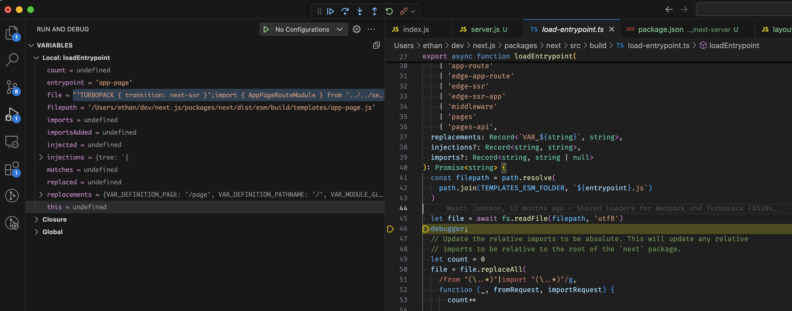

# Cannot use local Next.js build as Next.js Dev Server

## Reproduction

> I'm running this on a Mac M3 Sonoma 14.6.1

1. Clone `vercel/next.js`
2. Check out tag `v14.2.6` with `git checkout tags/v14.2.6`
3. (Install deps and build Next.js locally) Run `pnpm i`, then `cd packages/next-swc`, `pnpm build-native`, and then `cd ../..` and `pnpm build`
4. Link it locally, `npm link`

1. Clone this repo
2. Within `next-app`, run `npm i` - no need to link Next.js locally here
3. Within `next-server`, run `npm i` and `npm link next`
4. Run the server with `node server.js` (use Node v20)

Visit `localhost:3000`, you'll see `Invariant: Expect to replace at least one import` in the console:

```sh
testing/next-dev-server-issue/next-server via  v20.16.0 took 3s 
❯ node server.js
> Ready on http://localhost:3000
 ○ Compiling / ...
 ⨯ app/page.js
Invariant: Expected to replace at least one import
 ⨯ ../../../next.js/packages/next/dist/client/components/not-found-error.js
Invariant: Expected to replace at least one import
 ⨯ ../../../next.js/packages/next/dist/build/webpack/loaders/next-route-loader/index.js?kind=PAGES&page=%2F_error&preferredRegion=&absolutePagePath=..%2F..%2F..%2Fnext.js%2Fpackages%2Fnext%2Fdist%2Fpages%2F_error.js&absoluteAppPath=next%2Fdist%2Fpages%2F_app&absoluteDocumentPath=next%2Fdist%2Fpages%2F_document&middlewareConfigBase64=e30%3D!
Error: Invariant: Expected to replace at least one import
 GET / 500 in 2497ms
^C
```

Now if you just use the npm installed `next@14.2.6` dependency, everything works fine. But not being able to do this with a locally built version of Next.js is preventing me from debugging other things.

This error is coming from here: https://github.com/vercel/next.js/blob/v14.2.6/packages/next/src/build/load-entrypoint.ts#L83

I used a debugger on the local Next.js build, and discovered that when `load-entrypoint.ts` is executing, the template file it receives contains `'` characters instead of the `"` the regex is expecting. This makes me think its something with how I'm building Next.js locally? See the following screenshot for more info:

